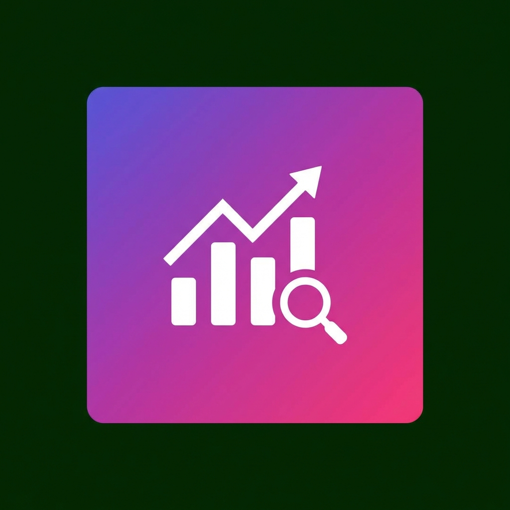

# Instagram Analytics Pro 📊

A Chrome extension that helps you analyze your Instagram followers and engagement. Discover who doesn't follow you back and identify followers who haven't interacted with your content.



## ⚠️ Important Disclaimers

> **Warning**: This extension uses web scraping techniques to extract data from Instagram's web interface. Please be aware:
> 
> - Instagram's Terms of Service may restrict automated data collection
> - Excessive use may trigger rate limiting or temporary account restrictions
> - The extension only works when you're logged into Instagram
> - Instagram frequently updates their UI, which may break functionality

## ✨ Features

### 1. **Find Non-Followers**
- Analyzes your following and followers lists
- Identifies users who don't follow you back
- Displays results with usernames and quick links to profiles

### 2. **Engagement Analysis**
- Checks who hasn't liked your posts
- Identifies followers with zero engagement
- Helps you understand your audience better

## 🚀 Installation

1. **Download the Extension**
   - Download or clone this repository to your local machine

2. **Enable Developer Mode in Chrome**
   - Open Chrome and navigate to `chrome://extensions/`
   - Toggle "Developer mode" in the top-right corner

3. **Load the Extension**
   - Click "Load unpacked"
   - Select the `instagram-analytics-extension` folder
   - The extension icon should appear in your toolbar

## 📖 How to Use

### Finding Non-Followers

1. Navigate to [Instagram.com](https://instagram.com) and log in
2. Go to your profile page
3. Click the extension icon in your Chrome toolbar
4. Click "Find Non-Followers"
5. Wait for the analysis to complete
6. View the list of users who don't follow you back

### Analyzing Engagement

1. Make sure you're on your Instagram profile page
2. Click the extension icon
3. Switch to the "No Engagement" tab
4. Click "Analyze Engagement"
5. The extension will check your recent posts for likes
6. View users who haven't engaged with your content

## 🏗️ Project Structure

```
instagram-analytics-extension/
├── manifest.json                 # Extension configuration
├── popup/
│   ├── popup.html               # Extension popup UI
│   ├── popup.css                # Popup styling
│   └── popup.js                 # Popup logic
├── content/
│   ├── instagram-scraper.js     # Scrapes followers/following
│   └── engagement-analyzer.js   # Analyzes engagement
├── background/
│   └── background.js            # Background service worker
├── utils/
│   └── utils.js                 # Utility functions
├── icons/
│   ├── icon16.png
│   ├── icon48.png
│   └── icon128.png
└── README.md
```

## 🛠️ Technical Details

- **Manifest Version**: 3
- **Permissions**: 
  - `storage` - Save cached data
  - `activeTab` - Interact with Instagram tabs
  - `scripting` - Execute content scripts
- **Host Permissions**: `https://www.instagram.com/*`

## ⚙️ How It Works

1. **Content Scripts**: Injected into Instagram pages to access DOM elements
2. **Scraping**: Navigates to follower/following lists and scrolls to load all users
3. **Data Processing**: Compares lists to find differences
4. **Local Storage**: Caches results to avoid repeated API calls

## 🔒 Privacy

- All data processing happens locally in your browser
- No data is sent to external servers
- No personal information is collected or stored
- The extension only accesses Instagram when you explicitly trigger an analysis

## 🐛 Known Limitations

- Instagram's UI changes frequently, which may require updates to selectors
- Story viewer data is only available for active stories (24 hours), not highlights
- Rate limiting may occur if you use the extension too frequently
- Large follower/following lists may take several minutes to process

## 🔄 Troubleshooting

**Extension doesn't work:**
- Make sure you're logged into Instagram
- Refresh the Instagram page
- Try disabling and re-enabling the extension

**Analysis takes too long:**
- This is normal for accounts with large follower counts
- The extension needs to scroll through all followers/following
- Be patient and avoid interrupting the process

**Data seems inaccurate:**
- Instagram's API may have changed - check for updates
- Try running the analysis again
- Make sure you're on your profile page

## 📝 License

This project is for educational purposes only. Use at your own risk.

## 🤝 Contributing

Feel free to submit issues or pull requests if you find bugs or have suggestions for improvements.

## 📧 Support

If you encounter any issues, please open an issue on GitHub with:
- A description of the problem
- Steps to reproduce
- Screenshots (if applicable)
- Your Chrome version

---

**Made with ❤️ for Instagram users who want better analytics**
